<div align="center">

# Drive-to-S3 & FTP-to-Snowflake Data Pipeline

Automated multi-source pipeline: monitors Google Drive + FTP server, syncs files to Amazon S3 by file type, tracks uploads in DynamoDB, and loads data continuously into Snowflake — running 24/7 on EC2.

[](https://python.org)
[](https://aws.amazon.com/s3/)
[](https://aws.amazon.com/dynamodb/)
[](https://aws.amazon.com/ec2/)
[](https://developers.google.com/drive)
[](https://www.snowflake.com/)

**Created by [Krish Kumawat](https://github.com/krishkumawat)**

</div>

---

## Table of Contents

- [Project Overview](#project-overview)
- [Phase 1 — Google Drive to S3](#phase-1--google-drive-to-s3)
  - [How It Works](#how-it-works)
  - [File Type Handling](#file-type-handling)
  - [Screenshots — Phase 1](#screenshots--phase-1)
  - [DynamoDB Status Schema](#dynamodb-status-schema)
  - [Setup and Installation](#setup-and-installation)
  - [Environment Variables](#environment-variables)
  - [EC2 Deployment Guide](#ec2-deployment-guide)
  - [Cron Job Setup](#cron-job-setup)
- [Phase 2 — FTP Server to S3 + Snowflake](#phase-2--ftp-server-to-s3--snowflake)
  - [FTP Architecture](#ftp-architecture)
  - [How the FTP Pipeline Works](#how-the-ftp-pipeline-works)
  - [Snowflake Integration](#snowflake-integration)
  - [Screenshots — Phase 2](#screenshots--phase-2)
  - [Challenges and Fixes](#challenges-and-fixes)
- [Phase 4 — Silver Layer](#phase-4--silver-layer-medallion-architecture)
- [Phase 5 — Gold Layer & Power BI](#phase-5--gold-layer--power-bi-dashboard)
- [Project Structure](#project-structure)
- [Security Best Practices](#security-best-practices)

---

## Project Overview

This project has two phases built on the same EC2 instance and DynamoDB tracking layer:

**Phase 1 (Day 1):** Drop a `.json` file into a Google Drive folder — the system picks it up, uploads it to S3, and logs the result in DynamoDB. Other file types were detected but skipped; the Drive pipeline was scoped only for JSON at this stage.

**Phase 2 (Day 2):** Set up an FTP server, uploaded `.csv` and `.parquet` files to it, and wrote a Python automation that runs on EC2 every 5 minutes — extracts files from FTP, uploads them to a dedicated S3 folder structure based on timestamp and file type, updates DynamoDB, then Snowflake continuously ingests data from S3 using Snowpipe.

---

## Phase 1 — Google Drive to S3

### How It Works

**Step 1 — Cron triggers the script every 5 minutes** on the EC2 instance.

**Step 2 — Fetch files from Drive.** The script lists all files in the configured `Retail_Incoming_Data` folder using the Google Drive API with OAuth2.

**Step 3 — Check DynamoDB for each file.** Before downloading anything, the script queries DynamoDB using the file's unique `file_id`. If a record already exists with status `UPLOADED` or `ALREADY_EXISTS`, the file is skipped.

**Step 4 — Detect file type.** For new files, the script reads the file extension and MIME type. In Phase 1, only `.json` files were processed — all other types were logged and skipped.

**Step 5 — Download and upload to S3.** The `.json` file is downloaded from Drive to a temporary path, then uploaded to `s3://global-data-mart-bucket/json/filename`.

**Step 6 — Write status to DynamoDB.** After a successful upload, a record is written with `file_id`, `file_name`, `s3_path`, `status`, and `updated_at`.

> **Note:** In Phase 1, the EC2 instance was set up manually on Ubuntu without an IAM role. AWS credentials (`AWS_ACCESS_KEY_ID` and `AWS_SECRET_ACCESS_KEY`) were stored in the `.env` file on the server. IAM role attachment was not configured at this stage.

---

### File Type Handling

The pipeline detects all file types but in Phase 1 only JSON was uploaded:

| Extension | S3 Folder | Phase 1 Status |
|---|---|---|
| `.json` | `s3://bucket/json/` | ✅ Uploaded |
| `.csv` | `s3://bucket/csv/` | ⏭️ Skipped (Phase 2) |
| `.xlsx` | `s3://bucket/xlsx/` | ⏭️ Skipped |
| `.pdf` | `s3://bucket/pdf/` | ⏭️ Skipped |
| `.png`, `.jpg` | `s3://bucket/images/` | ⏭️ Skipped |
| `.parquet` | `s3://bucket/parquet/` | ⏭️ Skipped (Phase 2) |
| others | `s3://bucket/other/` | ⏭️ Skipped |

---

### Screenshots — Phase 1

#### Google Drive — Monitored Folder

The script watches the `Retail_Incoming_Data` folder. Any new `.json` file dropped here is automatically picked up on the next 5-minute cycle.

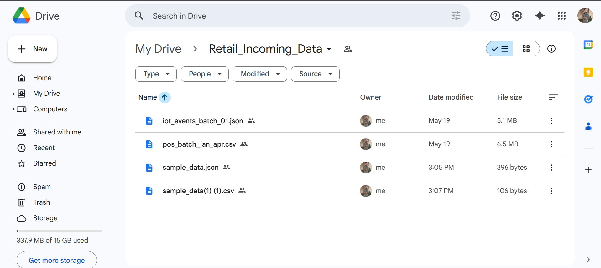

---

#### Amazon S3 — JSON Date Folder

Files are uploaded to `global-data-mart-bucket` under `json/YYYY-MM-DD/` date subfolders. The `2026-05-21/` folder contains 5 IoT event batch files (`iot_events_batch_01.json` through `_05.json`), each around 5.1 MB, auto-generated and uploaded on today's run.

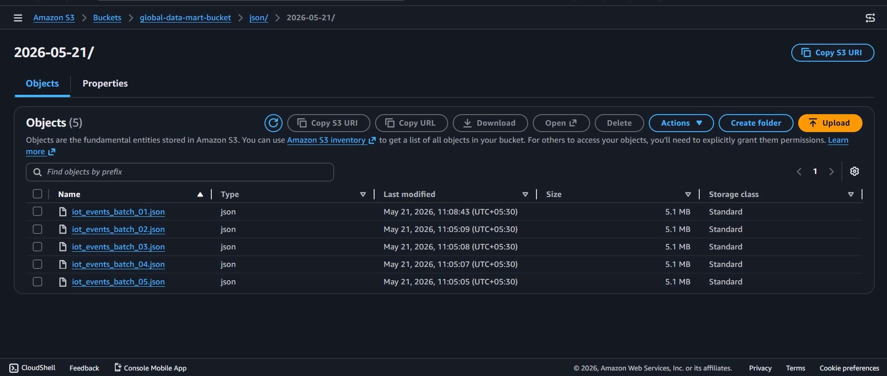

---

#### DynamoDB — File Upload Status Table

The `file_upload_status` table tracks every file processed. Each record shows the `file_id`, `file_name`, `s3_path`, `status`, and `updated_at` timestamp.

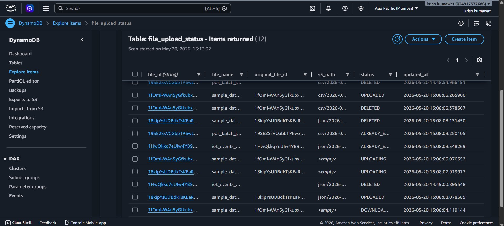

---

#### EC2 Instance — Running 24/7

The automation runs on a `t3.micro` EC2 instance named `drive-automation` in the `ap-south-1` (Mumbai) region. Ubuntu Server 22.04 LTS. Instance state is `Running` with 3/3 status checks passed. Instance ID: `i-0e84981da80a8395d`.

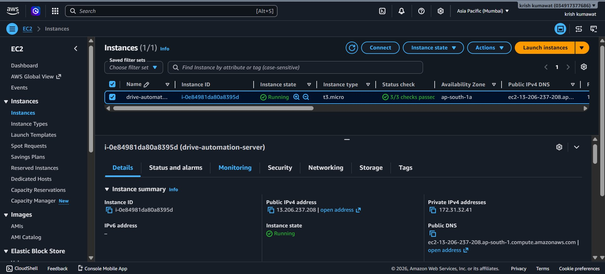

---

#### Cron Job — 5-Minute Schedule on EC2

The crontab entry on the EC2 instance runs `automation.py` every 5 minutes and appends all output to `automation.log`.

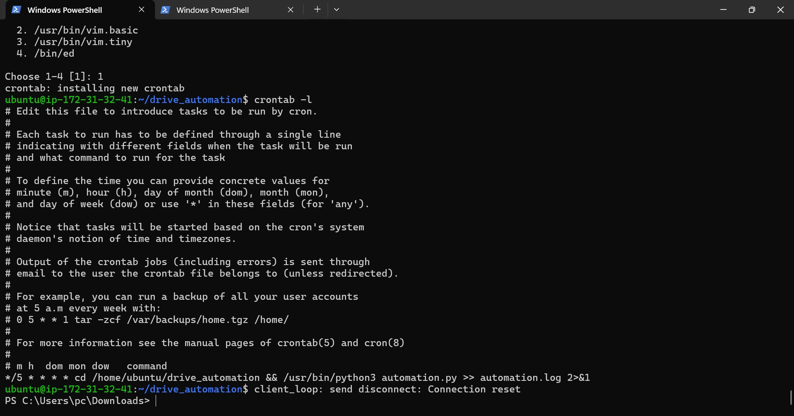

---

### DynamoDB Status Schema

**Table name:** `file_upload_status`  
**Primary key:** `file_id` (String)

| Attribute | Type | Description |
|---|---|---|
| `file_id` (PK) | String | Unique Google Drive file ID or FTP file path hash |
| `file_name` | String | Original file name |
| `original_file_id` | String | Source file ID (used for dedup check) |
| `s3_path` | String | Full S3 destination path |
| `status` | String | Current upload status |
| `updated_at` | String | ISO 8601 timestamp |

**Status values:**

| Status | Meaning |
|---|---|
| `UPLOADED` | Successfully uploaded to S3 |
| `ALREADY_EXISTS` | File found in a previous run — skipped |
| `UPLOADING` | Upload in progress |
| `DOWNLOADING` | Being downloaded from source |
| `DELETED` | File was removed from source or S3 |

---

### Setup and Installation

#### Prerequisites

- Python 3.10 or higher
- AWS account with S3, DynamoDB, and EC2 access
- Google Cloud project with Drive API enabled
- OAuth2 credentials (`credentials.json`) downloaded from Google Cloud Console

#### 1. Clone the repository

```bash
git clone https://github.com/krishkumawat/drive-to-s3-sync.git
cd drive-to-s3-sync
```

#### 2. Install dependencies

```bash
pip install -r requirements.txt
```

```
google-api-python-client
google-auth-httplib2
google-auth-oauthlib
boto3
python-dotenv
pysftp
pandas
pyarrow
fastparquet
```

#### 3. Set up Google Drive API

1. Go to [Google Cloud Console](https://console.cloud.google.com/) and create a project
2. Enable the **Google Drive API**
3. Create **OAuth 2.0 credentials** and download as `credentials.json`
4. Place `credentials.json` in the project root
5. Run the script once locally to complete the OAuth flow — this creates `token.json`

```bash
python3 automation.py
```

#### 4. Create AWS resources

```bash
# S3 bucket
aws s3 mb s3://global-data-mart-bucket --region ap-south-1

# DynamoDB table
aws dynamodb create-table \
  --table-name file_upload_status \
  --attribute-definitions AttributeName=file_id,AttributeType=S \
  --key-schema AttributeName=file_id,KeyType=HASH \
  --billing-mode PAY_PER_REQUEST \
  --region ap-south-1
```

---

### Environment Variables

```env
# Google Drive
DRIVE_FOLDER_ID=your_google_drive_folder_id

# AWS
AWS_ACCESS_KEY_ID=your_aws_access_key
AWS_SECRET_ACCESS_KEY=your_aws_secret_key
AWS_REGION=ap-south-1

# S3
S3_BUCKET_NAME=global-data-mart-bucket

# DynamoDB
DYNAMODB_TABLE_NAME=file_upload_status

# FTP (Phase 2)
FTP_HOST=your_ftp_host
FTP_USER=your_ftp_username
FTP_PASSWORD=your_ftp_password
FTP_REMOTE_DIR=/upload

# Snowflake (Phase 2)
SNOWFLAKE_ACCOUNT=your_account
SNOWFLAKE_USER=your_user
SNOWFLAKE_PASSWORD=your_password
SNOWFLAKE_DATABASE=your_database
SNOWFLAKE_SCHEMA=your_schema
SNOWFLAKE_WAREHOUSE=your_warehouse

# Optional
TEMP_DOWNLOAD_DIR=/tmp/drive_sync
LOG_LEVEL=INFO
```

> Never commit `.env`, `credentials.json`, or `token.json` to Git. All are listed in `.gitignore`.

---

### EC2 Deployment Guide

#### 1. Launch the instance

- **AMI:** Ubuntu Server 22.04 LTS
- **Instance type:** `t3.micro`
- **Region:** `ap-south-1` (Mumbai)
- **Security group:** Allow SSH (port 22) from your IP only

#### 2. Set up the environment on EC2

```bash
# SSH into EC2
ssh -i your-key.pem ubuntu@your-ec2-public-ip

# Install dependencies
sudo apt update && sudo apt install python3 python3-pip git -y

# Clone the repo
git clone https://github.com/krishkumawat/drive-to-s3-sync.git
cd drive-to-s3-sync
pip3 install -r requirements.txt
```

#### 3. Upload credentials from your local machine

```bash
scp -i your-key.pem credentials.json ubuntu@your-ec2-ip:~/drive-to-s3-sync/
scp -i your-key.pem token.json ubuntu@your-ec2-ip:~/drive-to-s3-sync/
scp -i your-key.pem .env ubuntu@your-ec2-ip:~/drive-to-s3-sync/
```

#### 4. Test manually

```bash
python3 automation.py
```

---

### Cron Job Setup

```bash
# Open crontab editor
crontab -e

# Add these lines (Phase 1 + Phase 2)
*/5 * * * * cd /home/ubuntu/drive_automation && /usr/bin/python3 automation.py >> automation.log 2>&1
*/5 * * * * cd /home/ubuntu/drive_automation && /usr/bin/python3 ftp_to_s3.py >> ftp.log 2>&1
```

Both scripts run every 5 minutes on the same EC2 instance — `automation.py` handles the Google Drive → S3 pipeline and `ftp_to_s3.py` handles the FTP → S3 → Snowflake pipeline.

Verify it is active:

```bash
crontab -l
tail -f /home/ubuntu/drive_automation/automation.log
tail -f /home/ubuntu/drive_automation/ftp.log
```

#### Cron Job — EC2 Screenshot

The crontab as it runs on the EC2 instance, showing both automation scripts scheduled every 5 minutes with separate log files.


---

## Phase 2 — FTP Server to S3 + Snowflake

### FTP Architecture

In Phase 2, an FTP server was set up as a new data source. The FTP server receives `.csv` and `.parquet` files, which are extracted by Python running on the same EC2 instance and uploaded to S3 under a folder structure based on file type and ingestion timestamp. From S3, Snowflake continuously loads the data using Snowpipe.

```
FTP Server (upload/)
    │
    │  pysftp / ftplib (EC2 Python script)
    ▼
Amazon S3 (global-data-mart-bucket)
    ├── ftp/csv/YYYY-MM-DD/filename.csv
    └── ftp/parquet/YYYY-MM-DD/filename.parquet
    │
    │  Snowpipe (auto-ingest via SQS)
    ▼
Snowflake Table
```

---

### How the FTP Pipeline Works

**Step 1 — Cron triggers `ftp_sync.py` every 5 minutes** on the EC2 instance (same cron schedule as the Drive pipeline).

**Step 2 — Connect to FTP server.** The script connects using credentials from `.env` and lists all files in the configured remote directory (`/upload`).

**Step 3 — Check DynamoDB for each file.** The script generates a unique key from `ftp_host + remote_path + filename` and queries DynamoDB. Files with status `UPLOADED` or `ALREADY_EXISTS` are skipped — no re-uploads.

**Step 4 — Detect file type.** The file extension (`.csv` or `.parquet`) determines the S3 destination subfolder.

**Step 5 — Download and upload to S3.** The file is downloaded to `/tmp/ftp_sync/`, then uploaded to:
- CSV: `s3://global-data-mart-bucket/ftp/csv/YYYY-MM-DD/filename.csv`
- Parquet: `s3://global-data-mart-bucket/ftp/parquet/YYYY-MM-DD/filename.parquet`

**Step 6 — Write status to DynamoDB.** Same schema as Phase 1 — `file_id`, `file_name`, `s3_path`, `status`, `updated_at`.

**Step 7 — Snowpipe auto-ingests.** Snowflake's Snowpipe listens for S3 PUT events via an SQS notification. As soon as a file lands in S3, Snowpipe queues it for loading into the target Snowflake table.

---

### Snowflake Integration

#### Storage Integration

A Storage Integration was created in Snowflake to allow secure, credential-free access to the S3 bucket. This avoids storing AWS keys inside Snowflake directly.

```sql
CREATE OR REPLACE STORAGE INTEGRATION s3_ftp_integration
  TYPE = EXTERNAL_STAGE
  STORAGE_PROVIDER = 'S3'
  ENABLED = TRUE
  STORAGE_AWS_ROLE_ARN = 'arn:aws:iam::YOUR_ACCOUNT_ID:role/snowflake-s3-role'
  STORAGE_ALLOWED_LOCATIONS = ('s3://global-data-mart-bucket/ftp/');

DESC INTEGRATION s3_ftp_integration;
-- Copy STORAGE_AWS_IAM_USER_ARN and STORAGE_AWS_EXTERNAL_ID
-- Add these as a trust relationship in the IAM role
```

#### External Stage

An External Stage points Snowflake to the S3 path where FTP-synced files land.

```sql
CREATE OR REPLACE STAGE ftp_data_stage
  STORAGE_INTEGRATION = s3_ftp_integration
  URL = 's3://global-data-mart-bucket/ftp/'
  FILE_FORMAT = (TYPE = 'CSV' FIELD_OPTIONALLY_ENCLOSED_BY = '"' SKIP_HEADER = 1);
```

#### Snowpipe

Snowpipe was configured with `AUTO_INGEST = TRUE` so that each new file arriving in S3 triggers automatic loading — no manual `COPY INTO` needed.

```sql
CREATE OR REPLACE PIPE ftp_csv_pipe
  AUTO_INGEST = TRUE
AS
  COPY INTO retail_data_table
  FROM @ftp_data_stage/csv/
  FILE_FORMAT = (TYPE = 'CSV' FIELD_OPTIONALLY_ENCLOSED_BY = '"' SKIP_HEADER = 1);

-- Get the SQS ARN from the pipe and configure it as an S3 event notification
SHOW PIPES;
```

After creating the pipe, the SQS ARN from `SHOW PIPES` was added to the S3 bucket's event notifications (PUT events on `ftp/csv/*` prefix) so Snowpipe receives a trigger for every new file.

---

### Screenshots — Phase 2

#### FileZilla — FTP Server Files

FileZilla connected to the FTP server at `sftp://3.109.139.36`. The remote `/home/ubuntu/ftp_files` directory contains 4 files: `sample_data.xlsx`, `pos_batch_sep_dec.xlsx`, `erp_orders.parquet`, and `erp_inventory.parquet` — these are the source files picked up by the EC2 automation script.

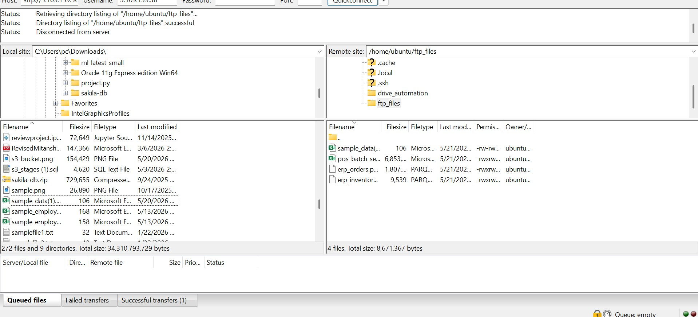

---

#### Amazon S3 — FTP Subfolder Structure

Files land in `global-data-mart-bucket` under `ftp/` with two subfolders — `csv/` and `parquet/` — created automatically based on file type during the first upload run.

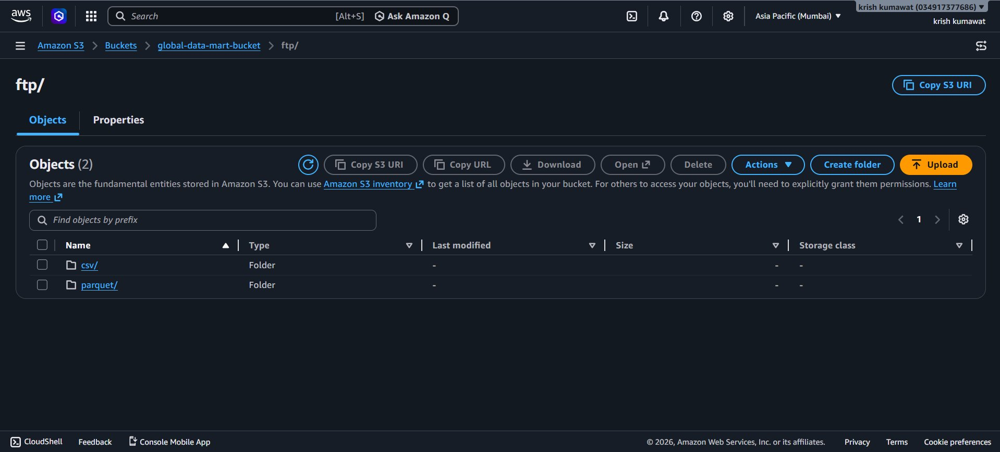

---

#### DynamoDB — Updated Table with FTP Records

The same `file_upload_status` table now contains records from both the Drive pipeline and the FTP pipeline. Records include statuses like `ALREADY_EXISTS`, `UPLOADING`, `DELETED`, and `ALREADY_E...` (already exists). FTP records use a composite key derived from `ftp_host + filepath`.

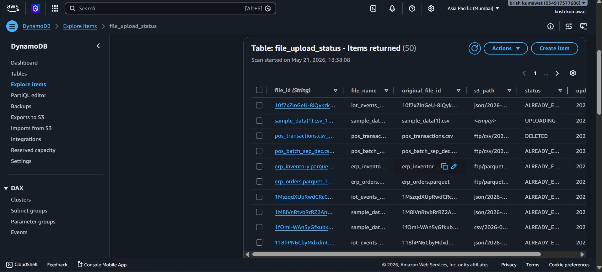

---

#### Snowflake — Storage Integration

The `s3_int` storage integration links Snowflake to `s3://global-data-mart-bucket/` via IAM role `arn:aws:iam::034917377686:role/global-data-mart` — no hardcoded AWS credentials inside Snowflake. The `DESC STORAGE INTEGRATION` result confirms the IAM user ARN, role ARN, and external ID needed for the trust policy.

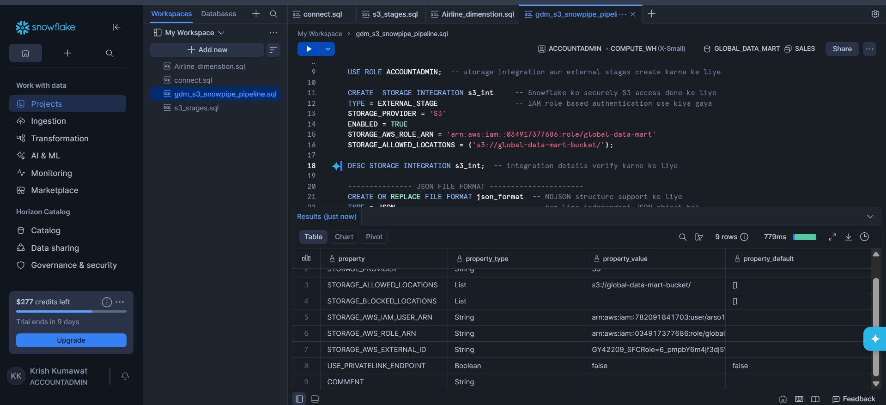

---

#### Snowflake — Snowpipes (SHOW PIPES)

`SHOW PIPES` confirms 4 active pipes in the `GLOBAL_DATA_MART.SALES` schema: `CSV_PIPE`, `INVENTORY_PIPE`, `JSON_PIPE`, and `ORDERS_PIPE`. Each pipes data from its respective S3 stage (`@csv_stage`, `@parquet_stage`, `@json_stage`) into the target Snowflake tables using `COPY INTO`. The `ALTER PIPE ... REFRESH` commands were run to manually ingest existing S3 files, and verified with `SELECT * FROM pos_transactions`, `erp_orders`, and `erp_inventory`.

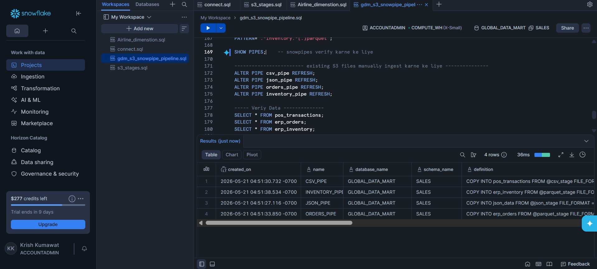

---

---

## Phase 3 — Snowflake Advanced Features

Phase 3 focuses on Snowflake-native features: table types, Time Travel, Streams, and Tasks — all implemented on top of the data already loaded in Phase 1 and Phase 2.

---

### Transient and Temporary Tables

Two additional table types were demonstrated to understand Snowflake's storage tiers:

**Transient Table** — `daily_sales_buffer` was created as a transient table from `pos_transactions`. Transient tables behave like permanent tables but skip Fail-Safe storage, reducing storage costs. Useful for intermediate buffer data that does not need disaster recovery.

**Temporary Table** — `temp_iot_dedup` was created from `json_data` as a temporary table. It exists only for the session duration and is automatically dropped when the session ends. Used for short-lived deduplication or staging logic.

---

### Time Travel

#### Using OFFSET

Time Travel was tested on `pos_transactions` using a controlled update:

```sql
UPDATE pos_transactions SET discount_pct = 99 WHERE discount_pct < 10;
```

After confirming the change, the 5-minute-old snapshot was accessed using `AT(OFFSET => -300)` and the table was fully restored:

```sql
CREATE OR REPLACE TABLE pos_transactions AS
SELECT * FROM pos_transactions AT(OFFSET => -300);
```

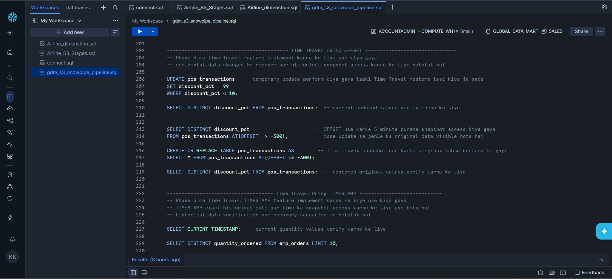

#### Using TIMESTAMP and BEFORE(STATEMENT)

`erp_orders` was updated and then recovered using an exact timestamp and a statement ID:

```sql
UPDATE erp_orders SET quantity_ordered = 1546 WHERE order_id = 'ORD_000001';

-- Recover using exact timestamp
SELECT quantity_ordered FROM erp_orders
AT(TIMESTAMP => '2026-05-21 22:47:49.667 -0700') WHERE order_id = 'ORD_000001';

-- Restore using BEFORE(STATEMENT)
UPDATE erp_orders SET quantity_ordered = (
    SELECT quantity_ordered FROM erp_orders
    BEFORE(STATEMENT => '01c48833-3202-b787-0016-ff76000deb06')
    WHERE order_id = 'ORD_000001'
) WHERE order_id = 'ORD_000001';
```

`BEFORE(STATEMENT)` targets the exact state before a specific query executed — more precise than OFFSET and preferred in production recovery.

---

### UNDROP TABLE

`erp_inventory` was intentionally dropped and recovered:

```sql
DROP TABLE erp_inventory;
SELECT * FROM erp_inventory;   -- throws error
UNDROP TABLE erp_inventory;
SELECT COUNT(*) FROM erp_inventory;  -- fully restored
```

Snowflake retains dropped tables within the Time Travel retention window. `UNDROP` restores the table along with all its data instantly.

---

### Fail-Safe Analysis

`INFORMATION_SCHEMA.TABLE_STORAGE_METRICS` was queried to compare permanent vs transient tables. Permanent tables include a 7-day Fail-Safe period beyond Time Travel. Transient tables skip Fail-Safe entirely — cheaper for non-critical data.

---

### Streams (CDC)

Four streams were created to track changes across all tables:

```sql
CREATE OR REPLACE STREAM pos_stream       ON TABLE pos_transactions  APPEND_ONLY = TRUE;
CREATE OR REPLACE STREAM orders_stream    ON TABLE erp_orders;
CREATE OR REPLACE STREAM inventory_stream ON TABLE erp_inventory     APPEND_ONLY = TRUE;
CREATE OR REPLACE STREAM json_stream      ON TABLE json_data          APPEND_ONLY = TRUE;
```

`SHOW STREAMS` confirms all 4 streams active in `GLOBAL_DATA_MART.SALES`:

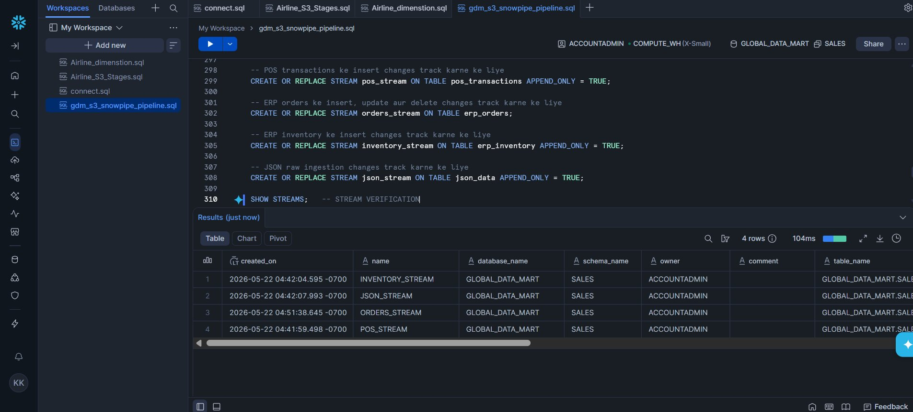

---

### Tasks (Automation)

Four tasks were created to process stream data every minute and resumed with `ALTER TASK ... RESUME`:

```sql
CREATE OR REPLACE TASK pos_task       WAREHOUSE = compute_wh SCHEDULE = '1 MINUTE' AS SELECT * FROM pos_stream;
CREATE OR REPLACE TASK orders_task    WAREHOUSE = compute_wh SCHEDULE = '1 MINUTE' AS SELECT * FROM orders_stream;
CREATE OR REPLACE TASK inventory_task WAREHOUSE = compute_wh SCHEDULE = '1 MINUTE' AS SELECT * FROM inventory_stream;
CREATE OR REPLACE TASK json_task      WAREHOUSE = compute_wh SCHEDULE = '1 MINUTE' AS SELECT * FROM json_stream;
```

`SHOW TASKS` confirms all 4 tasks in `GLOBAL_DATA_MART.SALES` with their schedule and IDs:

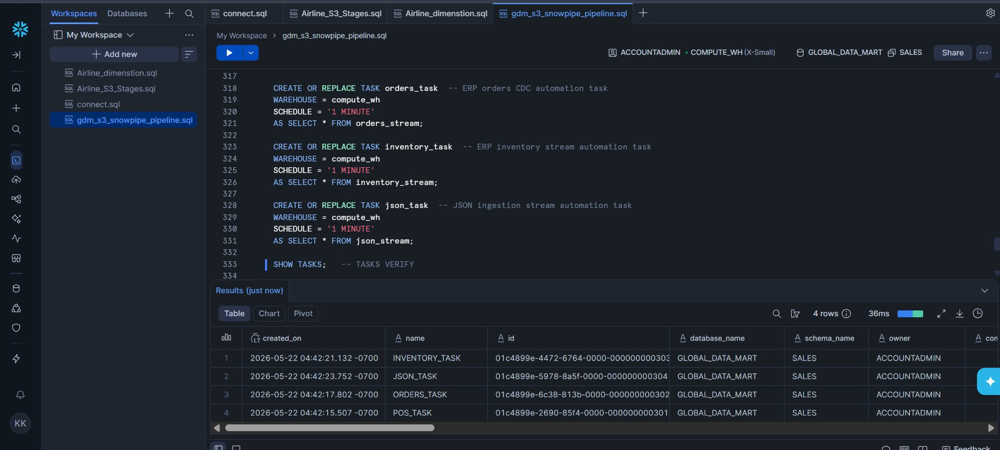

---

### Phase 3 — Challenges and Fixes

#### 1. Storage Integration — External ID Kept Changing

**Problem:** Every time the `s3_int` storage integration was dropped and recreated during testing, Snowflake generated a new `STORAGE_AWS_EXTERNAL_ID`. This broke the existing IAM trust policy in AWS — the External ID no longer matched, causing `AccessDenied` errors on every stage and Snowpipe operation.

**Fix:** Stopped dropping and recreating the integration. Used `CREATE OR REPLACE STORAGE INTEGRATION` only once and kept it persistent. When the External ID changed, `DESC STORAGE INTEGRATION s3_int` was run to fetch the latest values, and the IAM trust policy was manually updated in the AWS Console to match.

---

#### 2. APPEND_ONLY vs Standard Stream

**Problem:** For `erp_orders`, an `APPEND_ONLY` stream was initially created. But since orders get updated (status changes, quantity corrections), the stream was missing UPDATE and DELETE events — CDC was incomplete.

**Fix:** Recreated `orders_stream` as a standard stream (without `APPEND_ONLY = TRUE`) so it captures inserts, updates, and deletes via the `METADATA$ACTION` and `METADATA$ISUPDATE` columns.

---

### Challenges and Fixes

#### 1. FTP Connection — `pysftp` vs `ftplib`

**Problem:** Initially tried `pysftp` (SFTP) but the server was plain FTP, not SFTP. The connection kept timing out with a `paramiko` host key error.

**Fix:** Switched to Python's built-in `ftplib.FTP` with passive mode enabled (`ftp.set_pasv(True)`), which resolved both the protocol mismatch and firewall issues with active FTP.

---

#### 2. Parquet Files — Schema Mismatch in Snowflake

**Problem:** Parquet files uploaded from the FTP server had different column orderings and data types across batches. Snowflake's `COPY INTO` was failing with schema mismatch errors when trying to load them directly.

**Fix:** Added a normalization step in the EC2 script using `pandas` + `pyarrow` — all parquet files are read, column names are lowercased and stripped of spaces, and the file is re-written before upload to S3. This ensured consistent schema for Snowpipe ingestion.

---

#### 3. Snowpipe SQS Notification — Delay and Missing Triggers

**Problem:** After setting up Snowpipe with `AUTO_INGEST = TRUE`, some files were not being ingested automatically. The SQS queue was receiving events but Snowpipe wasn't always picking them up in time.

**Fix:** Verified the SQS ARN from `SHOW PIPES` was correctly added to S3 event notifications with the right prefix filter (`ftp/csv/*`). Also ran `SELECT SYSTEM$PIPE_STATUS('ftp_csv_pipe')` to check the queue and found a few stuck messages — cleared them by manually calling `ALTER PIPE ftp_csv_pipe REFRESH`.

---

#### 4. DynamoDB Dedup for FTP Files

**Problem:** FTP files don't have a unique ID like Google Drive's `file_id`. On reruns, the same file was being re-downloaded and re-uploaded.

**Fix:** Generated a deterministic `file_id` by hashing `ftp_host + remote_file_path` using `hashlib.md5`. This produces a consistent key for the same file across script runs, enabling the same DynamoDB dedup logic used in Phase 1.

---

#### 5. EC2 Credentials — No IAM Role in Phase 1

**Problem:** In Phase 1, AWS credentials were stored directly in `.env` on the EC2 instance. This works but is a security risk — if the instance is compromised, the keys are exposed.

**Fix (Phase 2 improvement):** Attached an IAM role to the EC2 instance with scoped S3 and DynamoDB permissions. Removed `AWS_ACCESS_KEY_ID` and `AWS_SECRET_ACCESS_KEY` from `.env`. `boto3` automatically picks up credentials from the instance metadata service — no keys needed on disk.

---

## Project Structure

```
drive-to-s3-sync/
│
├── automation.py          # Phase 1: Drive → S3 main script
├── ftp_sync.py            # Phase 2: FTP → S3 main script
├── drive_client.py        # Google Drive API wrapper
├── ftp_client.py          # FTP connection and file listing
├── s3_client.py           # S3 upload logic
├── dynamo_client.py       # DynamoDB read/write
├── file_type_detector.py  # Extension and MIME type detection
├── parquet_normalizer.py  # Parquet schema normalization (Phase 2)
│
├── snowflake/
│   ├── create_integration.sql
│   ├── create_stage.sql
│   └── create_pipe.sql
│
├── credentials.json       # Google OAuth2 credentials  [not committed]
├── token.json             # Google OAuth2 token        [not committed]
├── .env                   # Environment variables      [not committed]
├── automation.log         # Runtime log output         [not committed]
│
├── requirements.txt
├── .gitignore
└── README.md
```

---

## Security Best Practices

- Use an **IAM role on EC2** instead of storing AWS keys in `.env` on the server (implemented in Phase 2)
- Never commit `credentials.json`, `token.json`, or `.env` — all are in `.gitignore`
- Restrict the EC2 security group to allow SSH only from your IP address
- Use a **Snowflake Storage Integration** with an IAM role — never store AWS keys inside Snowflake
- Enable **S3 bucket versioning** to protect against accidental overwrites
- Enable **DynamoDB Point-in-Time Recovery** for the `file_upload_status` table
- Rotate FTP credentials periodically and restrict FTP server access by IP if possible

---

## Phase 4 — Silver Layer (Medallion Architecture)

Phase 4 introduced a proper **Bronze → Silver** pipeline using Snowflake's Medallion Architecture. Raw data from S3 now flows through staging tables first, then Tasks clean and transform it into Silver tables automatically.

Three separate pipelines were built — one for each source:

**CSV (POS transactions):** `csv_staging_pipe` loads raw CSV into `staging.stg_csv_transaction`, a Stream detects new rows, and `task_csv_to_silver` cleans and inserts into `silver_csv_transaction` — fixing negative values, splitting timestamp into date and time, and computing the actual order line total.

**JSON (IoT events):** `json_staging_pipe` loads raw JSON into `staging.stg_json_iot`, and `task_json_to_silver` uses `LATERAL FLATTEN` to explode nested `readings[]` and `alerts[]` arrays into clean rows inside `silver_iot_events`.

**Parquet (ERP orders):** `orders_bronze_pipe` loads into `staging.iot_raw_bronze`, and `task_orders_to_silver` runs a `MERGE` into `silver_erp_orders` — updating existing orders and inserting new ones based on `order_id`.

All three Tasks run every minute and only fire `WHEN SYSTEM$STREAM_HAS_DATA` — no unnecessary compute.

---

#### Snowflake — SHOW PIPES

4 active Snowpipes in `GLOBAL_DATA_MART.SALES` — `CSV_PIPE`, `INVENTORY_PIPE`, `JSON_PIPE`, and `ORDERS_PIPE` — each connected to its respective S3 stage.

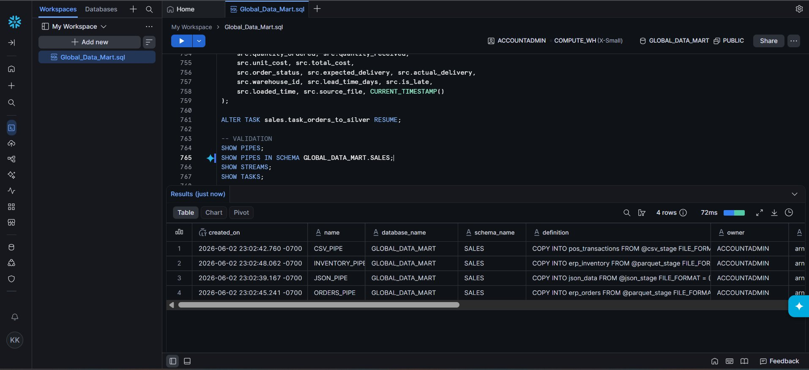

---

#### Snowflake — SHOW TASKS (Silver Layer)

3 Tasks running in `GLOBAL_DATA_MART.SALES` — `TASK_CSV_TO_SILVER`, `TASK_JSON_TO_SILVER`, and `TASK_ORDERS_TO_SILVER`. Each fires every minute only when its Stream has new data.

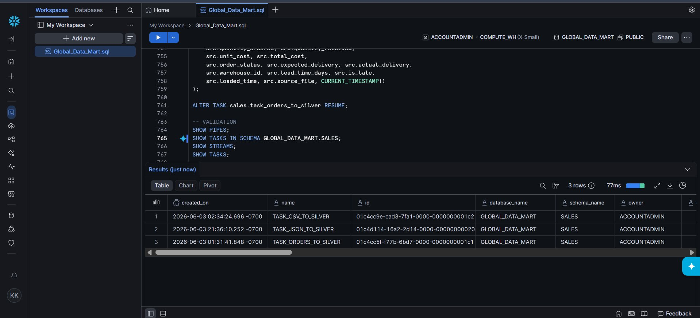

---

#### Silver CSV — `silver_csv_transaction` (240,000 rows)

Cleaned POS transaction data with split timestamp, corrected negative values, and computed `total_orderline`. Source: 10 stores across Istanbul, Izmir, Ankara, and Antalya.

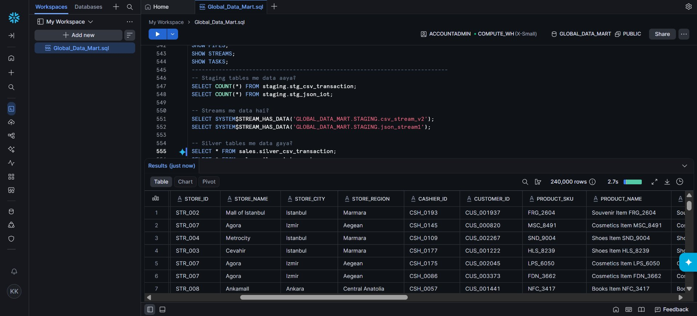

---

#### Silver IoT — `silver_iot_events` (120,000 rows)

IoT events with nested `readings[]` arrays flattened into individual rows using `LATERAL FLATTEN`. Each event expands into multiple sensor readings — `cold_storage`, `pos_terminal`, `entrance_gate` etc. — with `alert_type` and `alert_severity` extracted from `alerts[]`.

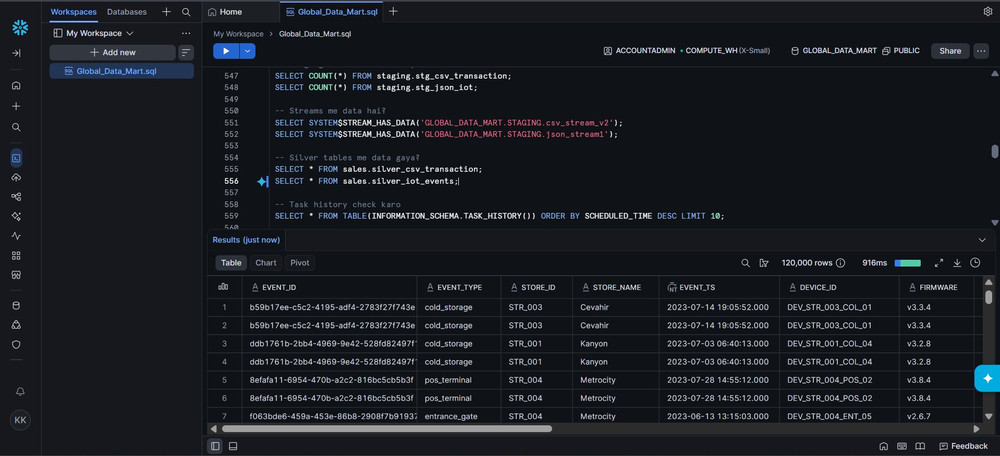

---

## Phase 5 — Gold Layer & Power BI Dashboard

Phase 5 builds the business-facing Gold layer on top of Silver tables and connects it to Power BI.

**`fact_decisions`** — Daily aggregation of POS transactions per store and category: total revenue, units sold, unique customers, average cart size. This is the base table for all Gold views.

**`fact_gross_margin`** — Joins `silver_csv_transaction` (POS revenue) with `silver_erp_orders` (ERP procurement cost) on `store_id + category` to compute gross profit and gross profit margin per store per category.

**`fact_iot_store_daily`** — Pivots IoT sensor readings into daily per-store columns: average temperature, occupancy, footfall, humidity, power, and total alert count.

**`fact_sales_verses_iot`** — Joins `fact_decisions` with `fact_iot_store_daily` on `store_id + date` — connects sales performance directly to IoT sensor conditions on the same day.

**Views** — `fact_kpi_summary`, `store_revenue` (rolling 30-day), `matelized_view_category_by_region`, `fact_daily_revenue` — all pre-aggregated for dashboard consumption.

---

#### Gold — `fact_gross_margin` (80 rows)

POS revenue joined with ERP procurement cost on `store_id + category`. Shows `total_revenue`, `total_cost`, `total_gross_profit`, and `gross_profit_margin` — the core business metric that was invisible before this pipeline.

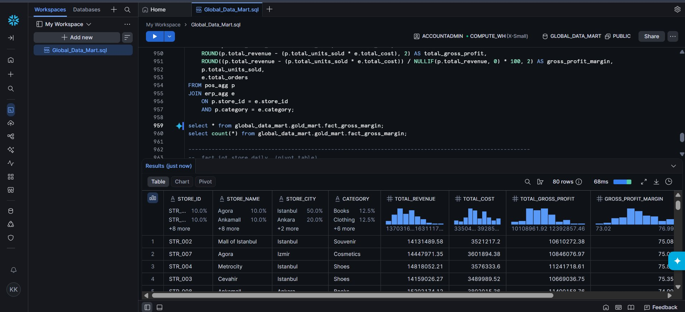

---

#### Gold — `fact_sales_verses_iot` (28,759 rows)

Sales data joined with IoT sensor readings on `store_id + date`. Each row shows a store's daily transactions, revenue, and basket size alongside the day's average temperature, footfall, occupancy, and alert count.

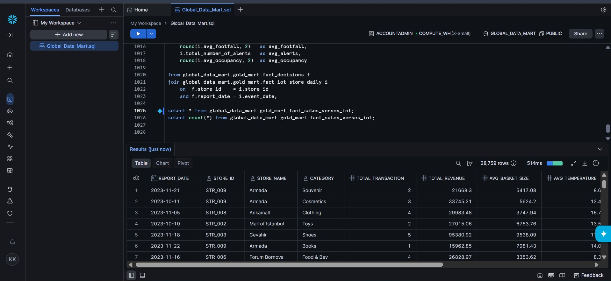

---

## Power BI Dashboard

Two dashboards built in Power BI connected directly to Snowflake Gold layer tables.

#### Global Retail Store Performance Overview

KPIs: 5,000 unique customers, 75.18% average gross profit margin, 120K total transactions, 1.17bn total revenue. Store-level breakdown by city, units sold by category, and revenue split by payment method (Cash / Credit Card / Debit Card — each ~33%).

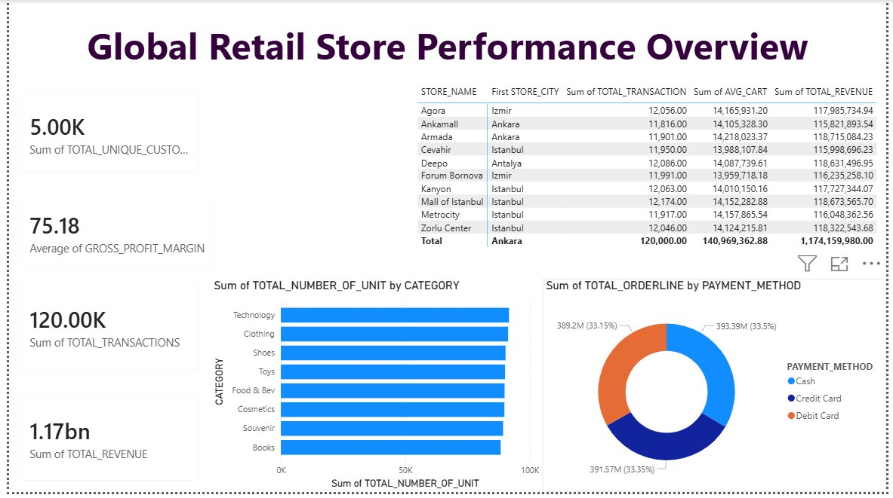

---

#### Sales & Customer Intelligence Dashboard

Daily revenue trend across full 2023 (Jan–Dec), total unique customers, average discount, and total units sold. Revenue line chart shows consistent daily throughput of 3–4M across all stores.

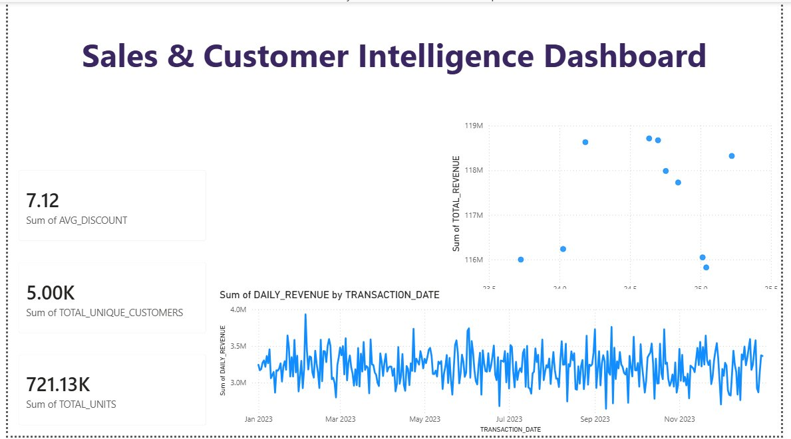

---

<div align="center">
<sub>Built by Krish Kumawat &nbsp;·&nbsp; Phase 1: Google Drive → S3 &nbsp;·&nbsp; Phase 2: FTP → S3 → Snowflake &nbsp;·&nbsp; Phase 3: Time Travel · Streams · Tasks &nbsp;·&nbsp; Phase 4: Silver Layer · Medallion Architecture &nbsp;·&nbsp; Phase 5: Gold Layer · Power BI &nbsp;·&nbsp; Runs 24/7 on AWS EC2 (ap-south-1)</sub>
</div>
