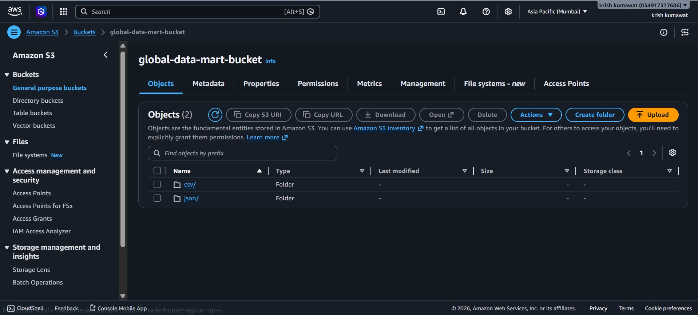

<div align="center">

# Drive-to-S3 Sync Automation

Automated pipeline that monitors a Google Drive folder, syncs files to Amazon S3 by file type, and tracks every upload in DynamoDB — running 24/7 on EC2.

[](https://python.org)
[](https://aws.amazon.com/s3/)
[](https://aws.amazon.com/dynamodb/)
[](https://aws.amazon.com/ec2/)
[](https://developers.google.com/drive)

**Created by [Krish Kumawat](https://github.com/krishkumawat)**

</div>

---

## Table of Contents

- [Project Overview](#project-overview)
- [How It Works](#how-it-works)
- [File Type Handling](#file-type-handling)
- [Screenshots](#screenshots)
- [DynamoDB Status Schema](#dynamodb-status-schema)
- [Setup and Installation](#setup-and-installation)
- [Environment Variables](#environment-variables)
- [EC2 Deployment Guide](#ec2-deployment-guide)
- [Cron Job Setup](#cron-job-setup)
- [Project Structure](#project-structure)
- [Security Best Practices](#security-best-practices)

---

## Project Overview

Drop a file into your Google Drive folder — this system handles everything else automatically.

The script runs every 5 minutes on an EC2 instance. It checks the configured Drive folder for new files, determines the file type, uploads each file to the correct S3 subfolder, and logs the result to DynamoDB. If a file was already uploaded in a previous run, it is skipped — no duplicates, no re-uploads.

**What it does:**

- Monitors a Google Drive folder using the Drive API with OAuth2
- Uploads new files to S3 under type-specific folders (`/json/`, `/csv/`, `/pdf/`, etc.)
- Checks DynamoDB before every upload to avoid duplicates
- Logs status (`UPLOADED`, `ALREADY_EXISTS`, `DELETED`, `UPLOADING`) to DynamoDB with timestamps
- Runs continuously via a cron job on EC2 — no manual intervention needed

---

## How It Works

**Step 1 — Cron triggers the script every 5 minutes** on the EC2 instance.

**Step 2 — Fetch files from Drive.** The script lists all files in the configured `Retail_Incoming_Data` folder using the Google Drive API.

**Step 3 — Check DynamoDB for each file.** Before downloading anything, the script queries DynamoDB using the file's unique `file_id`. If a record already exists with status `UPLOADED` or `ALREADY_EXISTS`, the file is skipped.

**Step 4 — Detect file type.** For new files, the script reads the file extension and MIME type to determine the correct S3 destination subfolder.

**Step 5 — Download and upload to S3.** The file is downloaded from Drive to a temporary path, then uploaded to `s3://global-data-mart-bucket/{type}/filename`.

**Step 6 — Write status to DynamoDB.** After a successful upload, a record is written with `file_id`, `file_name`, `s3_path`, `status`, and `updated_at`.

---

## File Type Handling

The pipeline auto-categorizes files into S3 subfolders based on extension and MIME type:

| Extension | S3 Folder | Example File |
|---|---|---|
| `.json` | `s3://bucket/json/` | `iot_events_batch_01.json` |
| `.csv` | `s3://bucket/csv/` | `pos_batch_jan_apr.csv` |
| `.xlsx` | `s3://bucket/xlsx/` | `report.xlsx` |
| `.pdf` | `s3://bucket/pdf/` | `invoice.pdf` |
| `.png`, `.jpg` | `s3://bucket/images/` | `photo.png` |
| `.txt` | `s3://bucket/txt/` | `notes.txt` |
| others | `s3://bucket/other/` | `archive.zip` |

---

## Screenshots

### Google Drive — Monitored Folder

The script watches the `Retail_Incoming_Data` folder. Any new `.json` or `.csv` file dropped here is automatically picked up on the next 5-minute cycle.


---

### Amazon S3 — Bucket with Type-Based Folders

Files are uploaded to `global-data-mart-bucket` under separate subfolders per file type. The `csv/` and `json/` folders were created automatically by the first sync run.



---

### DynamoDB — File Upload Status Table

The `file_upload_status` table tracks every file the script has processed. Each record shows the `file_id`, `file_name`, `s3_path`, `status`, and `updated_at` timestamp. Status values seen in production: `UPLOADED`, `ALREADY_EXISTS`, `DELETED`, `UPLOADING`, `DOWNLOADING`.


---

### EC2 Instance — Running 24/7

The automation runs on a `t3.micro` EC2 instance named `drive-automation-server` in the `ap-south-1` (Mumbai) region. Instance state is `Running` with 3/3 status checks passed.


---

### Cron Job — 5-Minute Schedule on EC2

The crontab entry on the EC2 instance runs `automation.py` every 5 minutes and appends all output to `automation.log`.


---

## DynamoDB Status Schema

**Table name:** `file_upload_status`  
**Primary key:** `file_id` (String)

| Attribute | Type | Description |
|---|---|---|
| `file_id` (PK) | String | Unique Google Drive file ID |
| `file_name` | String | Original file name |
| `original_file_id` | String | Drive file ID (used for dedup check) |
| `s3_path` | String | Full S3 destination path |
| `status` | String | Current upload status |
| `updated_at` | String | ISO 8601 timestamp |

**Status values:**

| Status | Meaning |
|---|---|
| `UPLOADED` | Successfully uploaded to S3 |
| `ALREADY_EXISTS` | File was found in a previous run — skipped |
| `UPLOADING` | Upload in progress |
| `DOWNLOADING` | Being downloaded from Drive |
| `DELETED` | File was removed from Drive or S3 |

---

## Setup and Installation

### Prerequisites

- Python 3.10 or higher
- AWS account with S3, DynamoDB, and EC2 access
- Google Cloud project with Drive API enabled
- OAuth2 credentials (`credentials.json`) downloaded from Google Cloud Console

### 1. Clone the repository

```bash
git clone https://github.com/krishkumawat/drive-to-s3-sync.git
cd drive-to-s3-sync
```

### 2. Install dependencies

```bash
pip install -r requirements.txt
```

```
google-api-python-client
google-auth-httplib2
google-auth-oauthlib
boto3
python-dotenv
```

### 3. Set up Google Drive API

1. Go to [Google Cloud Console](https://console.cloud.google.com/) and create a project
2. Enable the **Google Drive API**
3. Create **OAuth 2.0 credentials** and download as `credentials.json`
4. Place `credentials.json` in the project root
5. Run the script once locally to complete the OAuth flow — this creates `token.json`

```bash
python3 automation.py
```

### 4. Create AWS resources

```bash
# S3 bucket
aws s3 mb s3://global-data-mart-bucket --region ap-south-1

# DynamoDB table
aws dynamodb create-table \
  --table-name file_upload_status \
  --attribute-definitions AttributeName=file_id,AttributeType=S \
  --key-schema AttributeName=file_id,KeyType=HASH \
  --billing-mode PAY_PER_REQUEST \
  --region ap-south-1
```

### 5. Configure environment variables

Create a `.env` file in the project root — see [Environment Variables](#environment-variables) below.

---

## Environment Variables

```env
# Google Drive
DRIVE_FOLDER_ID=your_google_drive_folder_id

# AWS
AWS_ACCESS_KEY_ID=your_aws_access_key
AWS_SECRET_ACCESS_KEY=your_aws_secret_key
AWS_REGION=ap-south-1

# S3
S3_BUCKET_NAME=global-data-mart-bucket

# DynamoDB
DYNAMODB_TABLE_NAME=file_upload_status

# Optional
TEMP_DOWNLOAD_DIR=/tmp/drive_sync
LOG_LEVEL=INFO
```

> Never commit `.env`, `credentials.json`, or `token.json` to Git. All three are in `.gitignore`.

To find your Drive folder ID: open the folder in Google Drive and copy the ID from the URL — `https://drive.google.com/drive/folders/THIS_IS_THE_ID`.

---

## EC2 Deployment Guide

### 1. Launch the instance

- **AMI:** Ubuntu Server 22.04 LTS
- **Instance type:** `t3.micro`
- **Region:** `ap-south-1` (Mumbai)
- **Security group:** Allow SSH (port 22) from your IP only

### 2. Attach an IAM role

Attach an IAM role to the EC2 instance with the following permissions so you don't need to store AWS keys on the server:

```json
{
  "Version": "2012-10-17",
  "Statement": [
    {
      "Effect": "Allow",
      "Action": ["s3:PutObject", "s3:GetObject", "s3:ListBucket"],
      "Resource": "arn:aws:s3:::global-data-mart-bucket/*"
    },
    {
      "Effect": "Allow",
      "Action": ["dynamodb:GetItem", "dynamodb:PutItem", "dynamodb:UpdateItem", "dynamodb:Scan"],
      "Resource": "arn:aws:dynamodb:ap-south-1:*:table/file_upload_status"
    }
  ]
}
```

### 3. Set up the environment on EC2

```bash
# SSH into EC2
ssh -i your-key.pem ubuntu@your-ec2-public-ip

# Install dependencies
sudo apt update && sudo apt install python3 python3-pip git -y

# Clone the repo
git clone https://github.com/krishkumawat/drive-to-s3-sync.git
cd drive-to-s3-sync
pip3 install -r requirements.txt
```

### 4. Upload credentials from your local machine

```bash
scp -i your-key.pem credentials.json ubuntu@your-ec2-ip:~/drive-to-s3-sync/
scp -i your-key.pem token.json ubuntu@your-ec2-ip:~/drive-to-s3-sync/
scp -i your-key.pem .env ubuntu@your-ec2-ip:~/drive-to-s3-sync/
```

### 5. Test manually

```bash
python3 automation.py
```

Verify files appear in S3 and DynamoDB records are created before setting up the cron job.

---

## Cron Job Setup

The cron job runs `automation.py` every 5 minutes and logs all output to `automation.log`.

```bash
# Open crontab editor
crontab -e

# Add this line
*/5 * * * * cd /home/ubuntu/drive_automation && /usr/bin/python3 automation.py >> automation.log 2>&1
```

Verify it is active:

```bash
crontab -l
tail -f /home/ubuntu/drive_automation/automation.log
```

---

## Project Structure

```
drive-to-s3-sync/
│
├── automation.py          # Main script — entry point
├── drive_client.py        # Google Drive API wrapper
├── s3_client.py           # S3 upload logic
├── dynamo_client.py       # DynamoDB read/write
├── file_type_detector.py  # Extension and MIME type detection
│
├── credentials.json       # Google OAuth2 credentials  [not committed]
├── token.json             # Google OAuth2 token        [not committed]
├── .env                   # Environment variables      [not committed]
├── automation.log         # Runtime log output         [not committed]
│
├── requirements.txt
├── .gitignore
└── README.md
```

---

## Security Best Practices

- Use an **IAM role on EC2** instead of storing AWS keys in `.env` on the server
- Never commit `credentials.json`, `token.json`, or `.env` — all are in `.gitignore`
- Restrict the EC2 security group to allow SSH only from your IP address
- Enable **S3 bucket versioning** to protect against accidental overwrites
- Enable **DynamoDB Point-in-Time Recovery** for the `file_upload_status` table

---

<div align="center">
<sub>Built by Krish Kumawat &nbsp;·&nbsp; Runs 24/7 on AWS EC2 &nbsp;·&nbsp; Asia Pacific (Mumbai)</sub>
</div>
